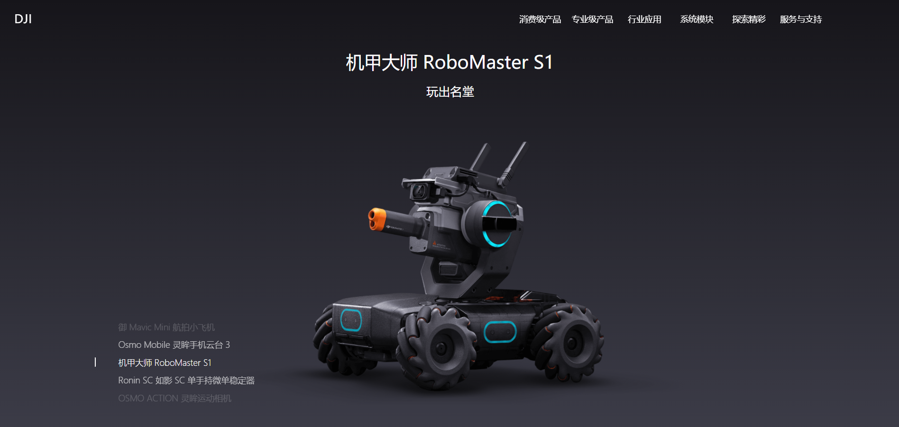

# 介绍

这是本人为了学习Vue.js框架而建立的项目，模仿大疆官网。  
实现了主页基本的一些控件以及其动态效果，有兴趣的可以编译试试。  
注意：安装个别模块时可能需要搭梯子，比如node-sass。

# 预览


# 编译步骤

``` bash
# install dependencies
npm install

# serve with hot reload at localhost:8080
npm run dev

# build for production with minification
npm run build

# build for production and view the bundle analyzer report
npm run build --report
```


